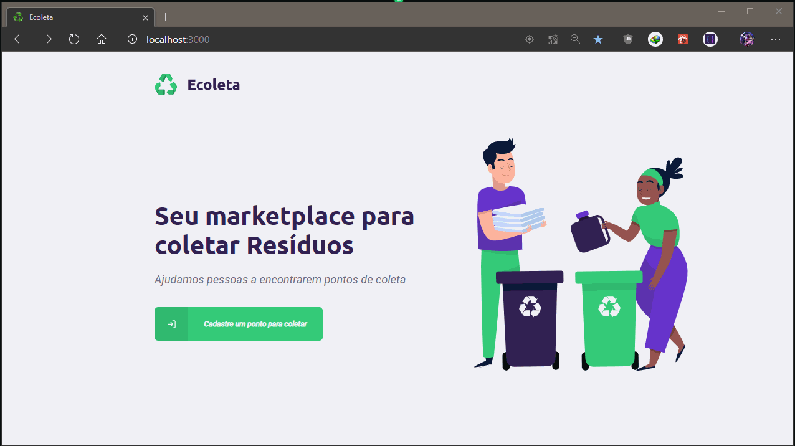
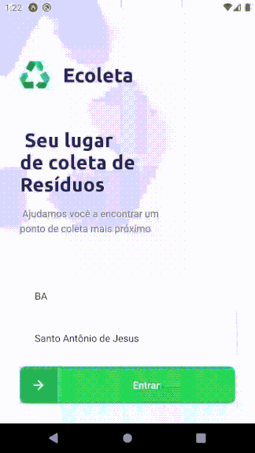

<h1 align=center >
  ♻️ Ecoleta ♻️
  
</h1>

<div align="center">
  <h1 align=center> 
    <a href="https://www.typescriptlang.org/">
      
    </a>
    <a href="https://pt-br.reactjs.org/docs/getting-started.html">
      
    </a>
    <a href="https://reactnative.dev/docs/getting-started">
      
    </a>
    <a href="https://docs.expo.io/">
      
    </a>
    <a href="https://nodejs.org/en/">
      
    </a>
  </h1>
</div> 

<p align="center">
  <a href="#recycle-projeto">Sobre o Projeto</a>&nbsp;&nbsp;&nbsp;|&nbsp;&nbsp;&nbsp;
  <a href="#battery-tecnologias-envolvidas">Tecnologias</a>&nbsp;&nbsp;&nbsp;|&nbsp;&nbsp;&nbsp;
  <a href="#battery-baixando-o-projeto">Baixando o Projeto</a>
</p>

<h1 align=center>
   
    
  
</h1>

Estas aplicações foram desenvolvido na semana **Next Level Week 1**,
realizada pela Rocketseat, utilizando as tecnologias: ***TypeScript , Node, ReactJS e React Native*** para
construção de uma api Rest para serviço da dados para aplicações web e mobile.


# :recycle: Projeto:
  O **Ecoleta** tem como objetivo ajudar pessoas a encontrarem **pontos de coleta** específico para cada tipo de item a ser coletado,
mutualmente com o cadastro do ponto e suas credenciais de endereço, contato e itens aceitos a coleta.
  Projeto proposto pela **[Rocketseat](https://rocketseat.com.br/)**, desenvolvido no novo evento online - **__Next Level Week 1.0__** -  com intuito de também repassar conhecimentos relacionados as
linguagem de programação JavaScript e sua stack para o front-end, back-end e mobile com
  
## :battery: Tecnologias envolvidas:
  
### *Typescript foi utilizado em todo o projeto.
  
<details>

  <summary> <b> &rarr; Para versão Web: </b> </summary>
  
  #### :computer: Web JSON info: <i><kbd> [package.json](./web/package.json) </kbd></i>
  
- [x] <b>Axios:</b> <i>Usado para o tratamento de rotas dos serviços da API </i>
- [x] <b>Leaflet:</b> <i>Mapa open-source usado para localização dos pontos de coleta</i>
- [x] <b>React-Dropzone:</b> <i>Ferramenta para upload do tipo Drag and Drop, usado para imagens dos estabelecimentos</i>
- [x] <b>React-icons:</b> <i>Estilos de ícones personalizados</i>
- [x] <b>React-Router-Dom:</b> <i>Para o gerenciamento de rotas</i>
</details>

<details>

  <summary> <b> &rarr; Para versão Mobile: </b> </summary>
  
  #### :iphone: Mobile JSON info: <i><kbd> [package.json](./mobile/package.json) </kbd></i>

- [x] <b>Expo:</b> <i>Para o desenvolvimento mobile mais eficiente </i>
- [x] <b>Expo Constants:</b> <i>Para uso de recursos do android, no caso deste projeto o StatusBarHeight.</i>
- [x] <b>Expo Location:</b> <i>Para utilização de recursos de localização</i>
- [x] <b>Expo-mail-composer:</b> <i>Para utilização de recusos para Mailing.</i>
- [x] <b>React Navigation /Stack:</b> <i>Para movimentação entre telas</i>
- [x] <b>React native SVG:</b> <i>Possibilitar utilização de imagens SVG</i>
- [x] <b>Axios:</b> <i>Usado para o tratamento de rotas dos serviços da API </i>
- [x] <b>React Native Maps:</b> <i> Para utilização de recursos para Geolocalização</i>
- [x] <b>Expo-Fonts:</b> <i>Estilos de fonts</i>

</details>

<details>

  <summary> <b> &rarr; Para o servidor (Node): </b> </summary>
  
  #### :cloud: Server JSON info: <i><kbd> [package.json](./api/package.json) </kbd></i>

- [x] <b>Express:</b> <i> Para criação do server no backend</i>
- [x] <b>Cors:</b> <i>Permissão de acesso</i>
- [x] <b>Knex:</b> <i>Como Query builder</i>
- [x] <b>SQLite:</b> <i>Banco utilizado</i>
- [x] <b>Multer:</b> <i>Para upload de imagens</i>
- [x] <b>Celebrate / JOI:</b> <i>Para validação do formulario</i>

</details>

<details>

  <summary> <b> &rarr; Outros Recursos: </b> </summary>

- [x] <b>React-icons:</b> <i>Estilização de ícones</i>
- [x] <b>APIs do IBGE para captura de UF e Cidade:</b> <i></i>
- [x] <b>Google Fonts:</b> <i>Robot e Ubuntu</i>
- [x] <b>Chocolatey:</b> <i>Como Package Manager do Windows por onde instalei o Node e o Yarn (no lugar do NPM);</i>
- [x] <b>Yarn:</b> <i>Neste projeto foi utilizado o <b>Yarn</b>, mas você pode utilizar o NPM normalmente</i>
- [x] <b>Insomnia:</b> <i>Para realização dos testes de rotas do server-api</i>
- [x] <b>Editor:</b> <i> [Visual Studio Code](https://code.visualstudio.com/) </i>

</details>

### :battery: Baixando o Projeto:
#### Pré-Requisitos:
  1. É nessário possuir o **Node.js** instalado na máquina
  2. Assim como o **GIT** para a clonagem do repositório
 
 Cada projeto tem suas particularidades, 
 como Expo para o Mobile, mas no geral após projeto baixado em sua máquina
 basta dar um:
  ```sh
    npm install
    or
    yarn install
  ```


<h1 align="center"> :golf: Made by: <a href="https://www.linkedin.com/in/gama-leal" /> Moacir Gama </a> :golf: </h1>
